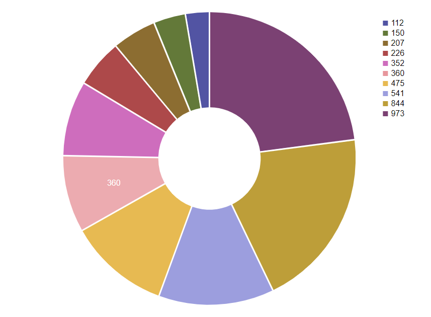

# React Donut Chart

This is a simple implementation of a D3 donut chart using ReactJS and D3.js version 4. I relied on some very useful tutorials like https://medium.com/localmed-engineering/svg-pie-chart-using-react-and-d3-43a381ce7246 and http://www.cagrimmett.com/til/2016/08/19/d3-pie-chart.html while there has been some further customization.

### Installation & setup

- Clone this repo
- Run npm install

### Development server

- Start the development server with `npm start`
- Point your browser at http://localhost:3000
- That's all it takes!

### Dependencies

- React ^16.2.0
- react-dom ^16.2.0
- D3 ^4.12.2
